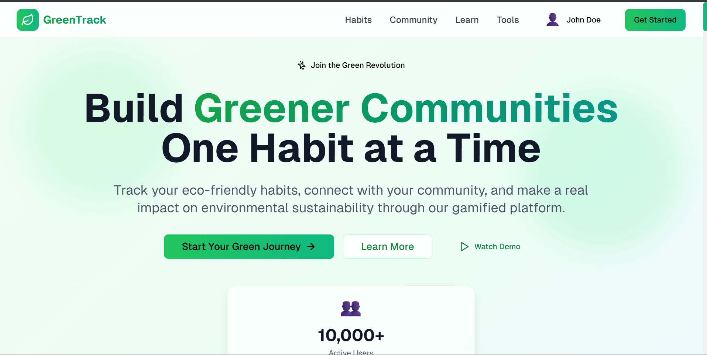
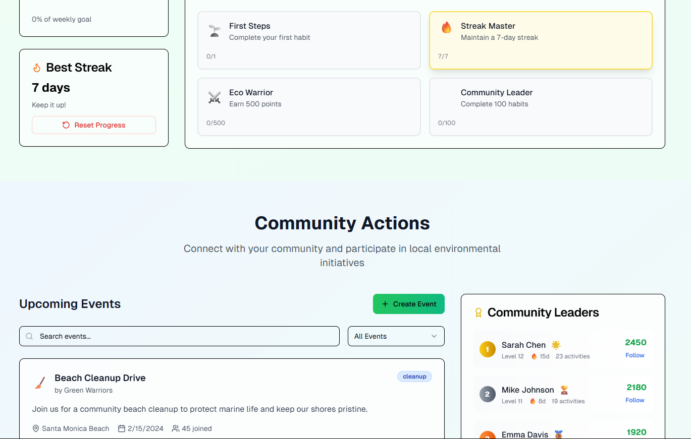
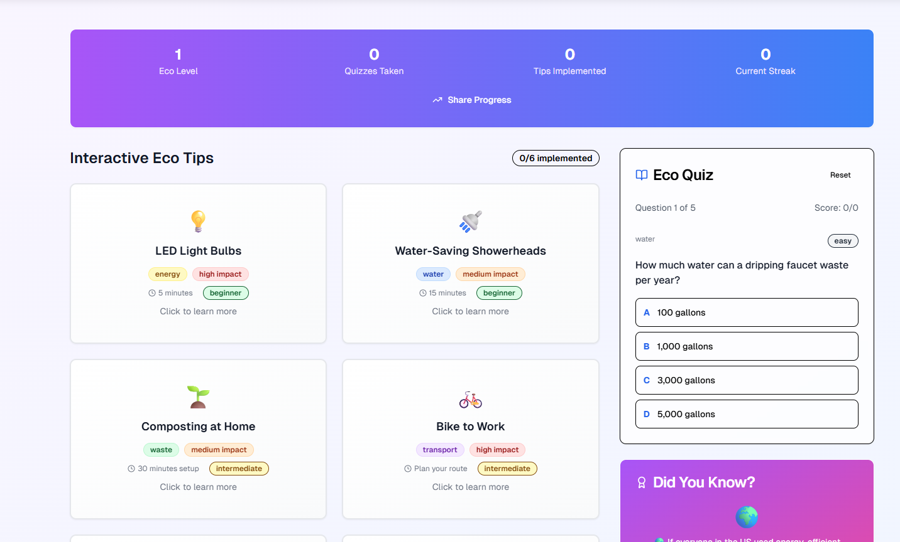
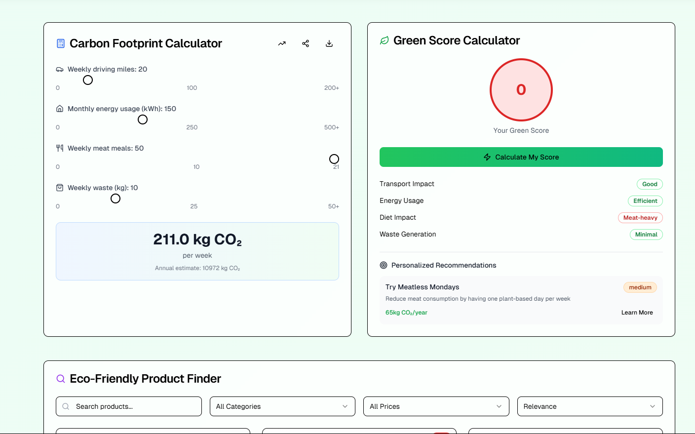
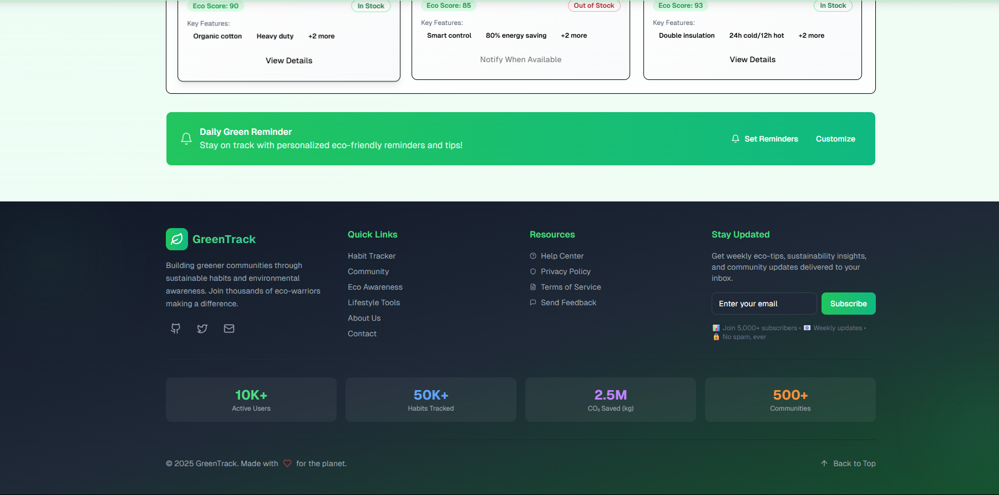
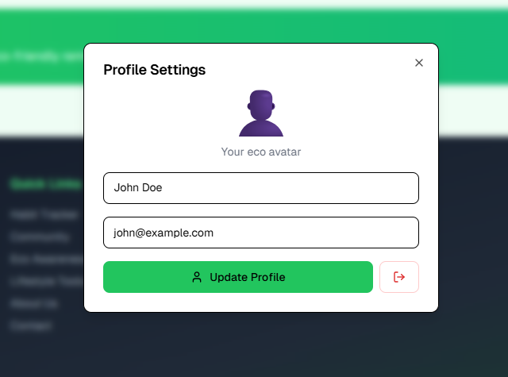

# 🌿 GreenTrack – Your Eco Lifestyle Companion

## 🧩 Problem Statement

**How might we build and deploy technology-driven solutions that actively promote cleaner, greener communities and environmental sustainability?**

GreenTrack is a front-end focused web platform designed to help individuals and communities adopt sustainable habits, track eco-friendly actions, participate in green challenges, and raise environmental awareness — all through a modern, interactive, and gamified user interface.

---

## 👨‍💻 Team Information

- **Team Name:** Return Zero
- **Members:**
  - Pranav S Nair – Team Lead
  - Joe George
  - Sreehari Sreekumar Nair
  - Thomas Cherian

---

## 📸 Screenshots

- 
- 
- 
- 
- 
- 

---

## 🔗 GitHub Repository

[👉 View the Project on GitHub](https://github.com/Pranavsanthoshnair/GreenTrack)

---

## 🚀 Features

- ✅ Daily Eco Habit Tracker with streaks and stats
- 🗺️ Map of community-led sustainability actions
- 📚 Fun awareness tools – quizzes, tips, and facts
- 🛠️ Lifestyle toolkit with carbon score calculator and eco-product finder
- 🎨 Gamified UI with badges, progress bars, and leaderboards
- ⚡ Built with **React + TypeScript + TailwindCSS** and hosted on **Vercel**

---

## 🛠️ Tech Stack

- **Frontend:** React, Vite, TypeScript, TailwindCSS, Framer Motion
- **Maps & Charts:** Leaflet.js, Recharts
- **Icons/UI:** ShadCN, Lucide Icons
- **Hosting:** Vercel

---

## 📬 Contact

For any questions or collaboration:
- Email: pranavsanthoshnair@gmail.com
- Phone: +916282617594
  
